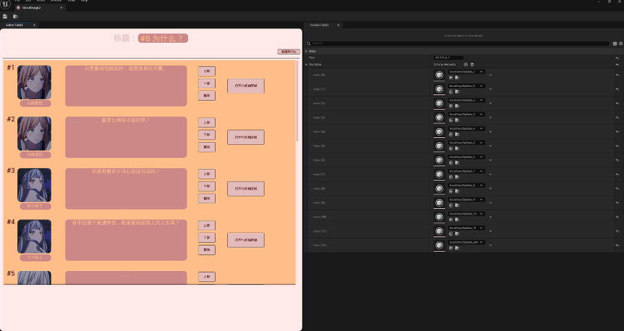

# UE5EditorTrial

不忙了，准备回坑  

因为工作中没什么机会碰编辑器，所以无聊的时候对ue5编辑器扩展做了一些个人尝试，随便玩玩。  
  

进度会以一定间隔给自己布置课题为主，会由易到难，从仅仅实现操作简化的功能性的编辑器，到带有时间轴、逻辑节点的编辑器，再到比较综合的动作编辑器。    

如果觉得做起来感觉不错会分享到别的平台，就酱。   

---
目前进度：  
## 课题1 制作一个自定义资产快速创建功能（√）  
课题内容：创建一个顶部的扩展菜单栏，允许操作者快速在指定目录生成一个指定名称的新uasset类型，编译之后可以在引擎中创建该类型uasset并进行编辑。  
① 新建一种类型的uasset资产  
② 在编辑器中建立一个顶部菜单栏工具，这个菜单选项可以生成一个类似UE原版的“创建新C++类”的面板  
③ 在其中想要创建的新类型的uasset资产的名称和创建文件的路径，然后这个工具将为我一键生成创建新uasset资产所需的文件，我只需点击编译就可以在工程中创建我需要的新uasset类型资产  

大概结果：  
  
  

---
## 课题2 制作一个简单的对话编辑器。（√）  
课题内容：首先，用课题一制作的工具制作一个对话框编辑类，它允许你编辑一个对话片段，一个对话片段包含：  
① 这个对话的标题  
② 每句对话包含该句话的序号、说话者的头像、说话者的名称、说话的内容，这些内容位于编辑器的主体，并且有一个滑轮用来控制  
③ 上方将会显示一个搜索框，允许搜索对话内容中包含搜索内容的对话  
④ 允许添加新的对话条目，并且可以通过操作按钮来移动对话条目  
⑤ 把编辑器的颜色变成可可爱爱的配色  
⑥ 支持撤销  
⑦ 通过自定义序列化来实现数据持久化，使得通过一个uasset就能序列化所有数据  

大概结果：  

---
## 课题3 对话的时间轴面板（Out）  
课题内容：我们知道，对话光播放直接显示一坨文字是不够的，我们要控制什么时候播放cv的声音、文字的显示速率、什么时候播放音效等等，如果是更复杂的游戏，我们可能还会移动镜头、播放震屏等等。而这些内容我们可以通过时间轴来控制。  
这个时间轴面板会包含：  
① 点击“打开时间轴面板”时，打开一个用于编辑当前的Clip的内容的时间轴面板，在此期间，你无法操作原本的编辑器，除非你关掉时间轴面板  
② 时间轴面板会由两个属性窗口、一个预览窗口、一个操作面板、一个时间轴板块组成，它的大抵结构如图所示  

③ Detail Tab，就是UE自己的Detail Tab，但我们需要挂一些事件来使得对应变量的值的更改可以刷新左侧面板。  
④ Preview Tab中，我们可以预览这一句话的表现效果，当然，这要求我们拥有一个执行器，后者应该是一个运行时的模块（但试作时，我们先不管这些）  
⑤ Tool Tab中，我们会放置一些为了方便而设置的工具按钮，比如添加Notify，给Notify排序等等，同时也会去设置一些基准值，比如Clip的总时长，帧率等等  
⑥ Timeline Tab中，我们会有一个时间轴，时间轴可以像Animsequence里那样缩放、滚动、操作准线等等，而Preview窗口则会相应地做出反应  
⑦ 每个Timeline里都会存在一个WordSpeedCurve Notify，它可以控制文字的播放速度，是一个不可删除的Notify  
⑧ 剩下的Notify可以拖拽，来调整在时间轴上的位置，会自动吸附到最小刻度（帧）  
⑨ 单击Notify可以打开Notify的Detail Panel并进行编辑  
⑩ 实现自定义序列化的多态，用于序列化多种Notify  
这个东西目前有一定进展，但不全有，因为在制作的过程中我发现UE的动画时间轴实际上把整个动画系统、PreviewScene、Notify树甚至是SkeletalMesh都耦上了，复刻一个他的时间轴需要的代码量巨大（而且我记不住）  
但是实际上时间轴系统有一定的灵活部分，我并不想每次制作新时间轴都要重新经历一遍复制几十个类几万行代码的痛苦过程。  
所以在完成课题3之前我们直接先跳到更上一层的课题4。  
发张图证明我真的有进展。
  

---
## 课题4 通用时间轴模板（进行中） 
课题内容：按上一个课题结尾所述，我会去制作一个通用的时间轴模板，从而使得我能够以最小的代价来量产可时间轴编辑的资产，并仅在此一个里维护基本的稳定性。
这个时间轴面板会包含：  
① 时间刻度，板，刻度线，下滑轮，左右滑轮，控制台等固有组件。  
② 基本的鼠标操作。
③ 预览窗口。  
④ NotifyTrack相关。  
⑤ 一些小工具。  
⑥ 基本的右键菜单。  
⑦ 可继承的Model，可扩展的PreviewScene，可继承的Notify。  
⑧ 可自由扩展的工具。  
⑨ 可自由排布的版面结构。  
